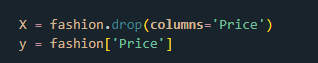
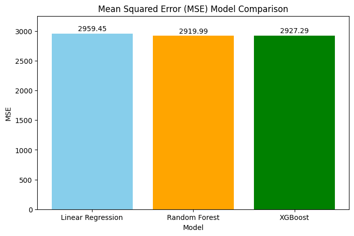
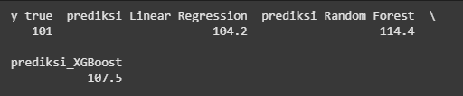

# Laporan Proyek Machine Learning - Dila Aura Futri

## Domain Proyek

Industri fashion di era digital saat ini mengalami transformasi besar melalui platform e-commerce yang terus berkembang. Perubahan tren konsumen yang cepat, musim, dan inovasi desain menuntut pelaku industri fashion untuk mampu beradaptasi dengan cepat dalam memahami kebutuhan pasar[1]. Untuk itu, pendekatan berbasis data menjadi sangat penting, terutama dalam menganalisis atribut produk seperti brand, kategori, warna, ukuran, dan material guna memahami pola penetapan harga dan kecenderungan pasar. Penelitian sebelumnya telah mengeksplorasi pemanfaatan machine learning dalam mendalami perilaku konsumen dan tren pasar di e-commerce, serta menyarankan eksplorasi lebih lanjut terhadap model prediktif kompleks seperti pohon keputusan dan jaringan saraf tiruan guna meningkatkan akurasi dan menangani data yang lebih kompleks[2].
Menjawab celah tersebut, proyek ini mengembangkan pendekatan prediktif dengan menerapkan algoritma tambahan selain regresi linear seperti Random Forest Regressor yang stabil [3] dan XGBoost Regressor dengan akurasinya yang tinggi karena pembelajaran iteratif[4]. Ketiga algoritma tersebut akan dibandingkan algoritma mana yang mampu menangkap hubungan non-linier antara atribut produk dan harga. Model ini digunakan untuk mengamati pola tren fashion di masyarakat dan memprediksi harga sebagai representasi nilai pasar. Dengan memanfaatkan dataset yang berisi enam variabel utama (Brand, Kategori, Warna, Ukuran, Material, dan Harga), pendekatan ini diharapkan mampu membantu pelaku industri fashion dalam merancang produk yang sesuai preferensi konsumen serta menetapkan harga secara lebih strategis dan kompetitif.

**REFERENSI**

[1] X. Li and J. Sha, “AI Tailoring: Evaluating Influence of Image Features on Fashion Product Popularity,” arXiv preprint arXiv:2411.14737, Nov. 2024. [Online]. Available: https://arxiv.org/abs/2411.14737

[2] Lisdarti and Yusril, “Machine Learning untuk Analisa Pola Tren Pasar dan Prediksi Permintaan Produk Menggunakan Metode Regresi Linear,” Jurnal Ilmiah LP2M Universitas Nurdin Hamzah Jambi, vol. 4, no. 1, pp. 62–67, 2022.

[3] D. H. Depari, Y. Widiastiwi, dan M. M. Santoni, “Perbandingan Model Decision Tree, Naive Bayes dan Random Forest untuk Prediksi Klasifikasi Penyakit Jantung,” Jurnal Informatik, vol. 18, no. 3, pp. 239–248, Des. 2022.

[4] W. Kurniawan and U. Indahyanti, “Prediksi Angka Harapan Hidup Penduduk Menggunakan Metode XGBoost,” Indonesian Journal of Applied Technology, vol. 1, no. 2, pp. 1–18, 2024. [Online]. Available: https://doi.org/10.47134/ijat.v1i2.3045

## Business Understanding

### Problem Statements

- Ketidakmampuan pelaku bisnis fashion dalam mengidentifikasi tren pasar secara akurat menyebabkan risiko produksi barang yang tidak sesuai dengan preferensi konsumen, yang pada akhirnya menurunkan angka penjualan.

- Tidak adanya pemahaman yang mendalam mengenai atribut produk yang berkontribusi terhadap harga membuat pelaku usaha kesulitan dalam menetapkan strategi harga yang kompetitif.

- Minimnya pemanfaatan model prediktif berbasis machine learning yang mampu menangkap pola kompleks dalam data fashion menyebabkan rendahnya efektivitas keputusan bisnis yang berbasis data.

### Goals

- Mengembangkan sistem berbasis data untuk mengidentifikasi tren fashion dengan menganalisis atribut produk (brand, kategori, warna, ukuran, material).

- Menyediakan wawasan mengenai atribut yang paling berpengaruh terhadap harga produk, sehingga dapat digunakan sebagai dasar dalam pengambilan keputusan harga dan pengembangan produk.

- Menerapkan dan membandingkan beberapa model prediktif seperti Linear Regression, Random Forest Regressor, dan XGBoost Regressor untuk menghasilkan prediksi harga yang akurat dan relevan dengan kondisi pasar fashion saat ini.

### Solution statements

Berikut beberapa rencana solusi yang dapat diukur dengan metrik evaluasi (MSE):

- Menerapkan tiga algoritma regresi berbeda — Linear Regression sebagai baseline, Random Forest Regressor sebagai model ensemble yang stabil, dan XGBoost Regressor sebagai model boosting yang lebih kompleks — untuk membandingkan performa prediktif masing-masing terhadap data atribut produk fashion.

- Mengukur performa setiap model menggunakan metrik evaluasi seperti Mean Absolute Error (MAE), Root Mean Squared Error (RMSE), dan R-squared (R²) untuk menentukan model terbaik dalam memprediksi harga produk.

- Menyajikan interpretasi dari model terpilih untuk mengetahui faktor-faktor utama yang mempengaruhi harga, sehingga hasil prediksi dapat diterjemahkan menjadi aksi bisnis yang nyata.

## Data Understanding

Dataset ini diunduh dari Kaggle : [Fashion Forecast Trending Textile Insights](https://www.kaggle.com/code/abdmental01/fashion-forecast-trending-textile-insights/notebook).

### Variabel-variabel pada Superstore Giant Sales Dataset dataset adalah sebagai berikut:

Dataset berisi 1.000 produk fashion dari sebuah perusahaan fast fashion Eropa, mencakup:

- Brand : Merek dari produk pakaian, dipilih dari sejumlah merek populer seperti Nike, Adidas, Puma, Under Armour, Reebok, dan New Balance.
- Category : Kategori dari produk pakaian, seperti Kaos (T-shirt), Celana Jeans, Gaun (Dress), Jaket, Sweater, atau Sepatu (Shoes).
- Color : Warna dari produk pakaian, dipilih dari berbagai pilihan warna seperti Merah, Biru, Hijau, Kuning, Hitam, dan Putih.
- Size : Ukuran dari produk pakaian, dinyatakan dalam ukuran standar seperti XS, S, M, L, XL, atau XXL.
- Material : Komposisi bahan dari produk pakaian, termasuk pilihan seperti Katun (Cotton), Poliester (Polyester), Nilon (Nylon), Wol (Wool), Sutra (Silk), dan Denim.
- Price : Harga dari produk pakaian, diukur dalam mata uang lokal.

### Eksplorasi Data Understanding

- Dataset memiliki 1.000 baris dan 6 kolom :
- Terdapat 5 kolom dengan tipe object, yaitu: Brand, Category, Color Size, Material (fitur non-numerik).
- Terdapat 1 kolom numerik dengan tipe data float64 yaitu: Price.
- Tidak ada missing value.
- Perlu dilakukan encoding dan normalisasi harga.
- Distribusi harga cenderung right-skewed.

## Data Preparation

Pada tahap ini, dilakukan dua teknik data preparation untuk mempersiapkan data mentah menjadi bentuk yang optimal.

- <b>Penentuan Fitur dan Target</b>
  **Variabel fitur (X)** mencakup seluruh kolom kecuali kolom Price, yaitu: Brand, Category, Color, Size, dan Material.
  **Variabel target (y)** adalah kolom Price, yang merepresentasikan harga produk fashion.
  

  
  

- <b>Encoding Fitur Kategori</b>
  Seluruh kolom fitur dalam X bertipe objek (string) diubah ke bentuk numerik menggunakan metode Label Encoding agar dapat diproses oleh algoritma machine learning.
  **Metode** : LabelEncoder dari sklearn.preprocessing.
  **Kolom yang diubah** :
  Semua kolom bertipe object diubah menjadi numerik : Brand, Category, Color, Size, Material.
- <b>Train-Test Split</b>
  **Metode** : train_test_split dari sklearn.model_selection.
  **Rasio pembagian** : Pembagian dataset diabgi menjadi 80:20 yaitu 80% data latih dan 20% data uji menggunakan train_test_split.
  **Tujuan** : Untuk mengukur kemampuan generalisasi model terhadap data yang belum pernah dilihat sebelumnya, serta menghindari overfitting.

## Modeling

Pada tahap ini dilakukan pembangunan dan evaluasi tiga model regresi untuk memprediksi harga produk fashion berdasarkan fitur seperti Brand, Category, Color, Size, dan Material. Algoritma yang digunakan meliputi:

1. Linear Regression
2. Random Forest Regressor
3. XGBoost Regressor

Seluruh model diuji dengan pendekatan yang konsisten, termasuk proses optimasi hiperparameter menggunakan Bayesian Optimization melalui BayesSearchCV. Penilaian performa model dilakukan menggunakan metrik Mean Squared Error (MSE) yang akan dibahas terpisah pada bagian Evaluation.

1. <b>Linear Regression</b>

- Cara Kerja
  Linear Regression merupakan model prediktif yang mengasumsikan hubungan linear antara variabel input (fitur) dan output (target). Model ini mencari garis lurus terbaik (hyperplane) yang meminimalkan jumlah kuadrat selisih antara nilai aktual dan nilai prediksi (least squares).
- Parameter
  Pada implementasi ini digunakan parameter default dari LinearRegression dari scikit-learn, yaitu:
  a. fit_intercept=True: model akan menghitung intersep.
  b. normalize=False: fitur tidak dinormalisasi (sekarang deprecated)
  c. n_jobs=None: tidak menggunakan paralelisasi.
- Kelebihan: Sederhana, cepat dilatih, mudah diinterpretasi.
- Kekurangan: Tidak cocok untuk hubungan non-linear, rentan terhadap multikolinearitas.

2. <b>Random Forest Regressor</b>

- Cara Kerja
  Random Forest adalah algoritma ensemble berbasis pohon keputusan yang membangun banyak decision tree dan menggabungkan prediksi dari setiap pohon (melalui rata-rata untuk regresi) untuk menghasilkan hasil akhir. Teknik ini mengurangi overfitting yang umum pada single decision tree dengan melakukan bootstrap sampling dan pemilihan subset fitur secara acak.
- Parameter
  Parameter yang dioptimasi menggunakan Bayesian Optimization (BayesSearchCV) meliputi:
  a. n_estimators: jumlah pohon dalam hutan (50–200)
  b. max_depth: kedalaman maksimum pohon (5–50)
  c. min_samples_split: jumlah minimum sampel untuk membagi node (2–10)Parameter lainnya menggunakan default, seperti: bootstrap=True dan criterion='squared_error'
- Kelebihan: robust terhadap outlier dan data yang tidak linear, performa baik tanpa banyak tuning.
- Kekurangan: kurang interpretatif dan lebih lambat dibanding model linier, terutama untuk dataset besar.

3. <b>XGBoost Regressor</b>

- Cara Kerja
  XGBoost (Extreme Gradient Boosting) adalah algoritma boosting berbasis pohon keputusan yang memperbaiki kelemahan model sebelumnya dengan menambahkan pohon baru secara iteratif. Setiap pohon dilatih untuk memperbaiki error dari pohon sebelumnya, dan proses ini dilakukan dengan optimasi gradien. XGBoost terkenal dengan kecepatan dan performanya yang tinggi dalam kompetisi data science.
- Parameter
  Parameter yang dioptimasi menggunakan BayesSearchCV:
  a. n_estimators: jumlah total pohon (50–200)
  b. max_depth: kedalaman maksimum tiap pohon (3–10)
  c. learning_rate: tingkat pembelajaran (0.01–0.3, log-uniform)
  d. subsample: proporsi sampel yang digunakan di tiap iterasi (0.5–1.0)Parameter lainnya menggunakan default bawaan XGBRegressor.
- Kelebihan: sangat akurat, mendukung regularisasi, dan menangani missing value secara internal.
- Kekurangan: lebih kompleks dan lebih lambat dibanding model simpler, sensitif terhadap hyperparameter.

## Evaluation

Evaluasi model dilakukan menggunakan metrik Mean Squared Error (MSE) karena proyek ini merupakan regresi. MSE mengukur rata-rata dari kuadrat selisih antara prediksi dan nilai aktual — semakin kecil nilai MSE, semakin baik performa model. 

<b>Hasil Evaluasi Model (MSE)</b>

  

<b>Kesimpulan Evaluasi</b>

1. Model Random Forest memberikan MSE terendah, menunjukkan generalisasi yang baik dan performa paling stabil terhadap data uji.
2. XGBoost mendekati Random Forest, namun sedikit lebih tinggi nilai error-nya.
3. Linear Regression memiliki MSE tertinggi, mengindikasikan bahwa model linear kurang mampu menangkap kompleksitas hubungan antar fitur.

Prediksi dari masing-masing model terhadap satu sampel data:

  

Model SVM (dengan pipeline dan scaling) menghasilkan prediksi paling dekat ke nilai aktual dan menunjukkan keseimbangan antara akurasi dan stabilitas.

<b>Business Evaluation</b>

- Model menjawab problem statement
  Model SVM, Random Forest, dan XGBoost telah mampu mempelajari pola data dan memberikan prediksi harga yang cukup akurat. Model SVM secara khusus menunjukkan keseimbangan terbaik antara akurasi dan stabilitas. Ini membantu pelaku bisnis fashion mengurangi risiko produksi barang yang tidak sesuai tren serta mendukung penetapan harga yang kompetitif berdasarkan data atribut produk seperti brand, warna, dan material.

- Model mencapai goals yang diharapkan
  a. Model SVM berhasil dibangun sebagai sistem prediksi harga berbasis data yang akurat dan stabil.
  b. Model-model tree-based seperti Random Forest dan XGBoost juga dievaluasi dan dapat digunakan untuk interpretasi fitur (meskipun tidak dipilih untuk deployment), memberikan wawasan penting tentang pengaruh atribut.
  c. Tiga model telah diterapkan dan dibandingkan (Linear Regression, Random Forest, XGBoost), dan evaluasinya membantu menentukan model yang paling cocok untuk diterapkan pada data pasar fashion.

- Dampak terhadap Solusi Statement
  a. Perbandingan model: SVM, Random Forest, dan XGBoost menunjukkan perbedaan signifikan dalam performa, dan hasil ini menunjukkan bahwa pemilihan model yang tepat dapat meningkatkan akurasi prediksi secara signifikan.
  b. Pemilihan metrik evaluasi yang relevan (MSE): Memberikan pemahaman numerik yang kuat terhadap performa model dalam konteks bisnis.
  c. Prediksi pada data baru: Menunjukkan bahwa SVM mampu memberikan estimasi harga yang paling dekat dengan kenyataan.

<b>Kesimpulan Akhir</b>
Model Support Vector Machine (SVM) dipilih sebagai model terbaik secara keseluruhan karena:

1. Memiliki error prediksi paling kecil pada data uji.
2. Tidak menunjukkan overfitting ekstrem seperti model tree-based.
3. Stabil dan cocok untuk deployment pada data fashion yang fluktuatif.

Proses modeling ini membuktikan bahwa pendekatan berbasis machine learning dapat digunakan untuk memahami dan memprediksi tren harga produk fashion secara lebih akurat dan berbasis data.
